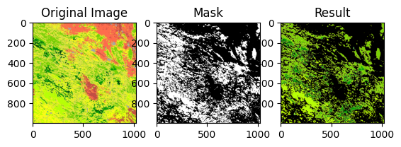
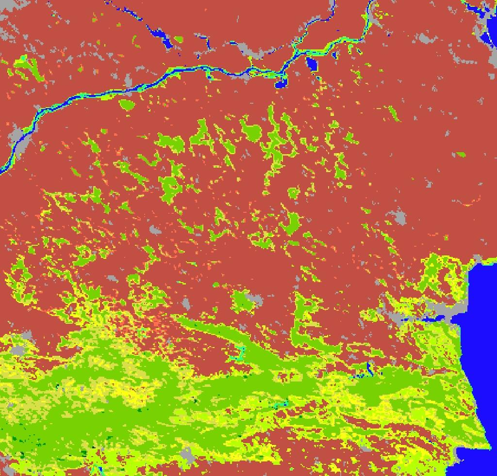
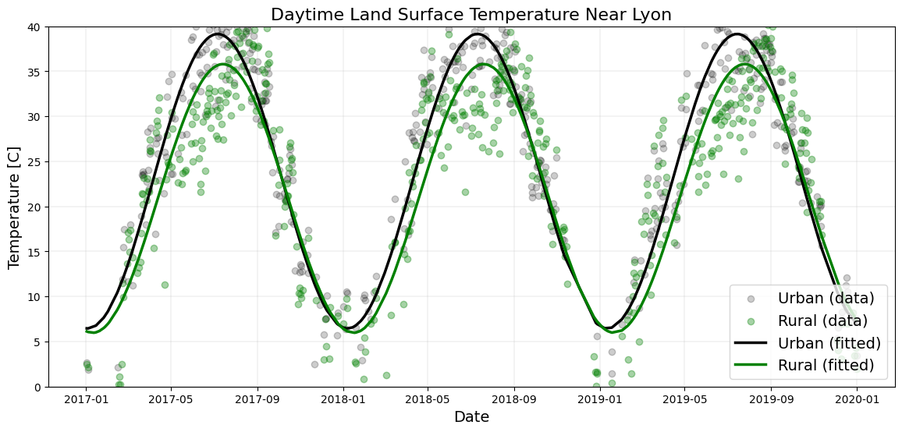

# SatVis

Small passion project following the [Earth Engine Python tutorial](https://developers.google.com/earth-engine/tutorials/community/intro-to-python-api?_gl=1*jcv5yo*_up*MQ..*_ga*NjY2MjA3OTA0LjE3Njk2ODMzODk.*_ga_SM8HXJ53K2*czE3Njk2ODMzODkkbzEkZzAkdDE3Njk2ODMzODkkajYwJGwwJGgw). We try to detect geographic transformations across time on different hyperspectral data. 

## Vegetation Mask Applied to Romanian Mountains 

## Semantically Labelled Romanian Region 

## Lyon Temperature Change

